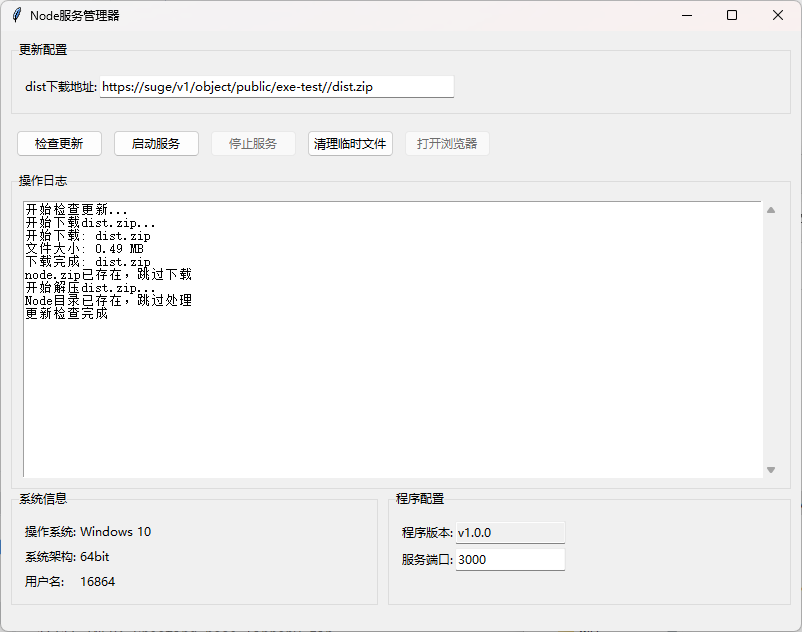
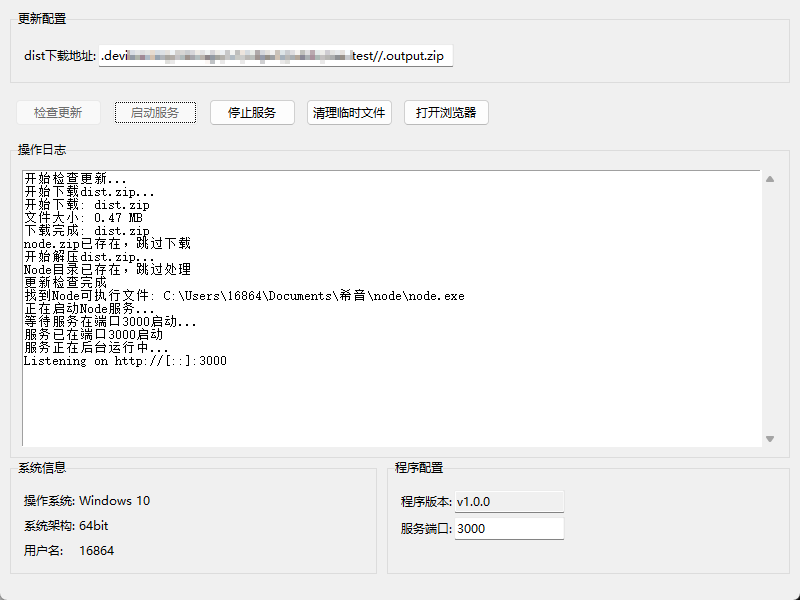

打包命令:
python -m pip install pyinstaller
python -m PyInstaller --onefile --noconsole --name NodeServiceManager --add-data "utils.py;." --add-data "config.json;." main.py

功能:
自动检测系统版本并下载对应的node.zip文件
然后下载dist.zip文件
分别解压, 使用node ./dist/server/index.mjs 启动服务

可自行修改

## nuxt项目
* 使用pnpm build打包项目
* 进入.output目录
* 压缩所有文件为.output.zip
* 上传.output.zip到服务器或对象存储
* 修改config.json中的dist_url为上传路径, 也可以直接在程序中修改
* 点击检查更新, 程序会自动下载dist.zip文件并解压
* 点击启动服务, 程序会自动启动服务

## 其他项目
修改config.json中的dist_name为压缩包名称